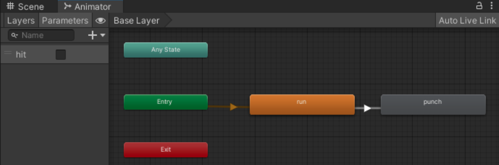

# Temple-Run-in-Medieval-City
Unity Version: 2022.3.26f1

<b>Temple Run in Medieval City</b> is an action-packed endless runner game where players take on the role of a daring Rabbit escaping from a powerful Stone Guardian through a medieval fortress. Navigate perilous paths, dodge obstacles, and avoid falling to survive the thrilling chase. With smooth animations, immersive sound effects, and a richly detailed environment, the game delivers an exhilarating experience.

## Scene Introduction
The game includes two scenes, one is showing the background animation, and another is serving as an interactive game similar to Temple Run. A smooth transition between scenes is implemented by using fading in/out.

### Scene 0 - Inside the Castle
The Rabbit sneaks inside the castle and gets caught by the Stone Guardian.

### Scene 1 - Escaping from the Stone Guardian
The Rabbit is trying to escape from the Stone Guardian without bumping into the barrels.

## Gameplay
In Scene 1, the player can use the Left Arrow and Right Arrow to control the character’s running direction, every click results in a 30-degree turn. Also, pressing the Up Arrow can make the character jump.

## Game Mechanism
The game will end whenever the player presses the esc button. Other than that, when in Scene 1, if the Rabbit falls out of the road, the game’s over. And if the Rabbit gets tripped by the barrels too many times, the Stone Guardian will catch up and punch the Rabbit, which will also end the game.

Circumstances: (1) falling down (2) getting tripped and then K.O. by the Stone Guardian

And the player can click on the restart button to start over from Scene 1.

## Character Animation
For the Rabbit in Scene 1, there are four states in the Animator: <i>run</i>, <i>jump</i>, <i>trip</i>, and <i>fall</i>. And there are four parameters used for transitions between them.

When the game starts, the Rabbit will be at the state <i>run</i>.
- <b>run → jump & jump → run</b>

    If the player presses the Up Arrow, the parameter jump will become true, enabling the transition from the state <i>run</i> to the state <i>jump</i>. After the jumping animation is finished, it will go back to the <i>run</i> state.

- <b>run → trip & trip → run</b>

    If the Rabbit bumps into a barrel, the Rabbit will trip. The incident is detected by monitoring the Rabbit’s y-coordinate of position. If the value is higher than 7 and the Rabbit is not jumping, then it is tripped by a barrel. Therefore, the parameter <i>trip</i> will be set to true, causing the transition from the state <i>run</i> to the state <i>trip</i>. And after the tripping animation is finished, it will go back to the <i>run</i> state.

- <b>run → fall</b>

    If (1) the y-coordinate of the Rabbit’s position is below 0.1, meaning that the Rabbit has fallen out of the road, or (2) the distance between the Rabbit and the Stone Guardian is less than 2.5, indicating that the Rabbit is caught up by the Stone Guardian, the parameter <i>fall</i> will be set to true, enabling the transition from the state <i>run</i> to the state <i>fall</i>.

As for the Stone Guardian in Scene 1, there are two states in the animator: <i>run</i> and <i>punch</i>. The mechanism is simple: the starting state is <i>run</i>, and when the Rabbit and the Stone Guardian are too close in distance, the Stone Guardian will switch to the <i>punch</i> state.

## Timeline Animation
In Scene 0, I used Timeline to create animations for camera movement, animation transition for the Stone Guardian, loading the scene, switching cameras, and playing audio clips.

## Particle System
In Scene 0, I used the Sand Swirl Effect in the package: Particle Pack - Unity Technologies.

## Background Music
I used an audio clip from the package: Free Music Tracks For Games - Rizwan Ashraf.
It starts playing once the game starts, and will not stop until the game is closed.

## Sound Effect
I used audio clips from the package: FREE Casual Game SFX Pack - Dustyroom

### Scene 0 - Inside the Castle
There are four audio clips used in Scene 0 for the animation, all implemented using Timeline.

### Scene 1 - Escaping from the Stone Guardian
Three audio clips are used in Scene 1: <i>trip_sound</i>, <i>lose_sound</i>, and <i>button_sound</i>.
- <i>trip_sound</i>: trigger when the Rabbit is tripped by a barrel.
- <i>lose_sound</i>: trigger when the Rabbit falls out of the road or gets caught by the Stone Guardian.
- <i>button_sound</i>: trigger when the player clicks on the restart button.

## Other Asset Store Packages
1. Polylised - Medieval Desert City - Ink Phantom

2. Modular Castle - PolySoft3D
